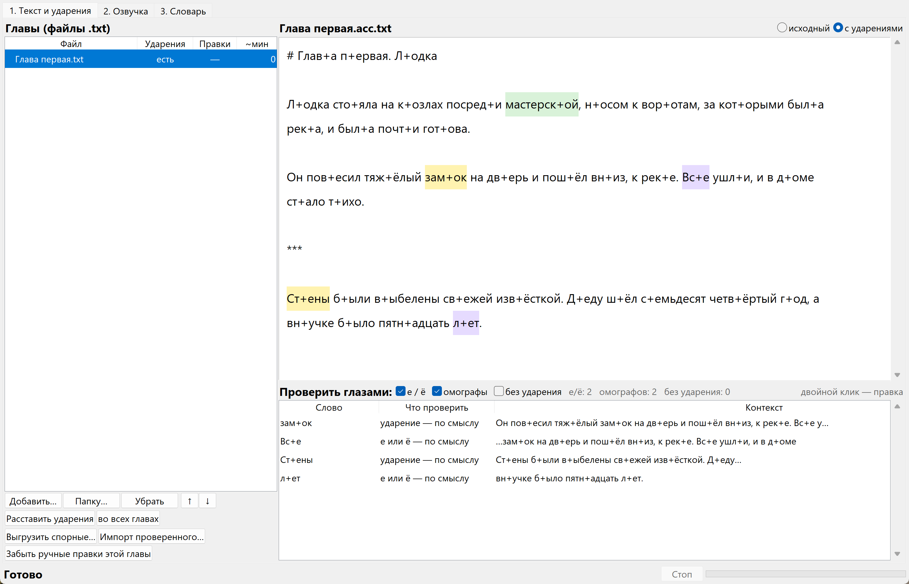

# Аудиокнига

Настольное приложение для Windows: берёт главы книги в текстовых файлах,
расставляет в них ударения и озвучивает голосом Silero. Всё работает офлайн
на процессоре, без облаков и подписок. Час звука получается примерно за
минуту.

Синтезатор произносит **слова**, а слушают **фразу**. Между этими двумя
уровнями и лежит всё, чем занята эта программа.

Свободные модели закрывают слово: RUAccent ставит в нём ударение и решает
«е» или «ё», Silero его озвучивает. Но в живой речи не каждое слово ударно.
Одни прислоняются к соседям и теряют ударение, другие, наоборот, его
перетягивают, и русская фонетика давно дала этой единице имя —
**фонетическое слово**, ударное слово вместе с прилипшими к нему
безударными. Ни одна свободная модель этот уровень не держит.

Для аудиокниги это не мелочь. Ошибка в ударении не портит текст, который
можно перечитать глазами, но в звуке спотыкаешься и теряешь фразу, а
перемотать назад на слух тяжело. При этом ошибки не экзотические, а из
самых частых слов: «и **то**, как она заполнялась» читается «и **та**»,
«что-то» — «что **та**», «чему бы то **ни** было» — «ни **бы**ло», а вопрос
без вопросительного слова вообще звучит утверждением. На часе записи такое
встречается десятки раз.

Отсюда и способ, которым всё сделано: не обучением модели, а разметкой
текста перед ней — и на слух. Почти каждое правило ниже появилось после
того, как очередное слово прозвучало не так.

### ⬇ [Скачать готовую программу](https://github.com/dbacchus/audiobook-ru/releases/latest)

Распаковать и запустить `Аудиокнига.exe` — ни Python, ни настройка не нужны.
Исходный код ниже нужен тем, кто хочет менять программу под себя.



## Чем это отличается от «просто TTS»

Синтезатор читает текст, но не знает русских ударений. Отдельные проекты
ставят ударения, но не дают их проверить и поправить. Здесь обе части
соединены, и вся работа идёт вокруг главного вопроса: **как узнать, что
слово прочитается правильно, до того как прослушаешь час записи**.

* **Ударения по смыслу.** Омографы разбирает RUAccent: «повесил зам+ок» и
  «старый з+амок», «пот+ом вернулся» и «покрылся п+отом».
* **Проверка глазами.** Места, где выбор делала модель, собраны в таблицу с
  контекстом: 300 фраз вместо 100 КБ текста. Сиреневым — где решается «е»
  или «ё», жёлтым — где ударение меняет смысл.
* **Три области правки.** Слово можно поправить только здесь, во всей главе
  или занести в словарь. Правка «только здесь» привязана к абзацу и
  переживает повторную расстановку — контекстные случаи словарём не лечатся.
* **Авторская орфография не портится.** Если текст ёфицирован, ваше «е»
  остаётся вашим: иначе «не швартовались **лет** пятнадцать» превращается
  в «л+ёт», а «— **Все** за» в «Вс+ё за».
* **Числа, римские цифры, markdown.** «15 лет» → «пятнадцать лет»,
  «в 2038 году» → «в две тысячи тридцать восьмом году», «Интерлюдия I» →
  «Интерлюдия первая». Цифр и латиницы в алфавите модели нет, она их просто
  выбрасывает.
* **Английские слова читаются по произношению, а не по буквам.** «I will be
  back» → «ай уил би бэк», «save as» → «сэйв эз», «screenshot» → «скриншот».
  Произношение и ударение берутся из словаря CMUdict на 126 тысяч слов;
  голос при этом остаётся тот же, без переключения на английскую модель.
* **Выделение голосом.** Слово заглавными читается с нажимом: «Она
  повторила: НИКОГДА».
* **Прослушать на месте.** Выделяете абзац — слышите, как он звучит. Самая
  честная проверка.

## Фонетическое слово

Единица, о которой шла речь вначале, в русской фонетике называется ещё
**речевым тактом**: безударные слова прислоняются к ударному спереди
(проклитики) или сзади (энклитики) и произносятся с ним как одно целое.
Почти все правила этой программы описывают именно её:

* `в`, `на`, `и`, `бы` знака не получают: они прислоняются к соседу, и
  безударная «о» в них законно звучит как [а] — «по доро́ге»;
* а `что`, `как`, `где`, `то` — ударные слова, и без знака «и то, как она
  заполнялась» читается «и та»;
* `-то` в «что-то» энклитика, и дефис перед ней надо убрать, иначе модель
  прочтёт её отдельным словом: «что та»;
* в обороте «чему бы то **ни** было» ударение перетягивает частица, а глагол
  остаётся безударным — тот же сдвиг, что в «**не** был», «**на** воду»;
* `что` сразу после двоеточия прислоняется к пояснению, а после запятой нет.

Ни одна модель здесь не дообучалась и ни один вес не менялся: правится только
представление входа. Саму акцентологию мы тоже не изобретали, она описана в
словарях ударений задолго до нас. Новое тут одно — она сведена в код для
конкретной пары свободных моделей. Не открытие, а притирка; но именно её и
не хватало.

Подробности каждого правила, с тем что проверялось и что не помогло, —
в [docs/notes.md](docs/notes.md).

## Установка

### Готовая программа

Скачайте архив из раздела [Releases](../../releases), распакуйте куда угодно
и запустите **`Аудиокнига.exe`**. Ни Python, ни настройка не нужны: модели
голоса и ударений лежат внутри, интернет не потребуется. Единственное, что
программа докачает сама (и спросит разрешения), — ffmpeg для mp3, 73 МБ.

Папка может называться по-русски и лежать где угодно — это проверено
отдельно, потому что библиотеки внутри к таким путям чувствительны.

### Из исходников

Понадобится Python 3.10 или новее.

```
pip install torch --index-url https://download.pytorch.org/whl/cpu
pip install -r requirements.txt
python audiobook_app.py
```

Отдельная команда для torch не прихоть: с обычного PyPI приедет сборка с
поддержкой видеокарт на несколько гигабайт, а приложению хватит версии для
процессора. При первом запуске скачаются модели: голосовая (87 МБ) и модели
ударений (около 700 МБ), дальше интернет не нужен.

## Как этим пользоваться

1. **Текст и ударения** → «Добавить…» → главы в `.txt` или `.md`.
2. «Расставить ударения». Рядом с главой появится `глава.acc.txt` — обычный
   текст со знаками `+`, его можно править где угодно.
3. Просмотреть подсвеченные места, спорные поправить двойным кликом,
   сомнительные — прослушать.
4. **Озвучка** → выбрать голос, нажать «Озвучить все».

В меню **Справка** есть «О программе» — там версия, лицензии и пути к
моделям; кнопка «Скопировать сведения» пригодится, если будете писать об
ошибке.

Формат текста простой:

```
# Глава первая. Лодка      заголовок: читается медленно и ниже голосом

Обычный абзац.

***                        смена сцены: пауза подлиннее
```

## Автономная сборка

```
python build_exe.py            папка dist/Audiobook, ~1.5 ГБ
python build_exe.py --zip      плюс архив (~770 МБ)
```

Получается папка, которой не нужны ни Python, ни интернет: копируется на
любой Windows-компьютер целиком. Проверить сборку: `Аудиокнига.exe
--selftest` — прогоняет ударения, синтез и mp3 и пишет отчёт рядом с exe.

Флаги: `--with-nc` добавит модель `v5_5_ru` (см. лицензию ниже),
`--with-ffmpeg` вложит ffmpeg вместо скачивания.

## Заметки о поведении моделей

В [docs/notes.md](docs/notes.md) собрано то, что выяснилось при работе:
почему «ё» нужен знак ударения, хотя она всегда ударная; почему `что` после
двоеточия звучит иначе, чем после запятой; как отличить авторское «е» от
пропущенной «ё»; чего нет в алфавите модели; почему словарь стоит держать
коротким. Это не про русскую фонетику — она описана в словарях ударений
и специальной литературе, — а про то, как ведут себя конкретные модели.

## Три подводных камня Windows

Все обойдены в коде, но знать полезно, если будете переделывать:

* **torch не открывает файлы по путям с кириллицей** — внутри сишный `fopen`
  в системной кодировке, и на существующем файле он сообщает «нет такого
  файла». Модель читается в память и передаётся потоком.
* **Морфология RUAccent (pycrfsuite)** страдает тем же, а её путь берётся от
  расположения модуля и не подменяется — поэтому `Tagger` получает короткое
  8.3-имя Windows.
* **`__file__` в собранной программе** указывает внутрь `_internal`, и туда
  же уезжают настройки с результатами. Рабочий каталог берётся от
  `sys.executable`.

## Словари

`dictionaries/example.json` — пример: морские и ремесленные термины, на
которых автомат спотыкается. Свой словарь пополняется прямо в приложении
(двойной клик по слову → «в словарь»).

**Общеупотребительные слова в словарь лучше не заносить.** Правило
«потом → пот+ом», верное для одной книги, испортит фразу «покрылся потом» в
другой, которую автомат читает правильно сам. То же с «мастерской»: как
помещение это мастерска́я, но «ма́стерская рука» — уже прилагательное, и
словарная запись сломает второй случай. Для таких слов есть правка «только
здесь»: она привязана к абзацу и не трогает остальной текст.

Словарь полезно иногда пересматривать: модели ударений обновляются. При
проверке на повести, ради которой всё писалось, из 116 накопленных записей
нужными оказались 27 — имена и редкие термины; остальное автомат уже читает
верно сам, а две записи и вовсе портили правильные места.

## Авторы и лицензии

Идея, постановка задач и приёмка на слух — dbacchus.
Код — Claude (Anthropic) под его руководством. Заметная часть решений найдена
именно ухом: выделение голосом по заглавным буквам, безударное «что» после
двоеточия, пропавшее ударение на «ё».

Код приложения — MIT. Компоненты:

| что | лицензия |
|---|---|
| модель **v5_cis_base** (по умолчанию, 29 русских голосов) | MIT |
| модели `v5_5_ru` и другие русские Silero | CC BY-NC — **только некоммерческое использование** |
| RUAccent | Apache 2.0 |
| словарь произношений CMUdict (Carnegie Mellon University) | BSD |
| PyTorch, ONNX Runtime, Transformers, python-crfsuite | BSD / MIT / Apache / MIT |
| ffmpeg (скачивается отдельно) | LGPL |

Модель по умолчанию выбрана не случайно: `v5_cis_base` не умеет ставить
ударения сама и ждёт готовых `к+ошка` — то есть ровно то, что делает эта
программа. Взамен она свободна по лицензии и даёт 29 русских голосов вместо
пяти. Если переключитесь на `v5_5_ru`, помните про её условия.
